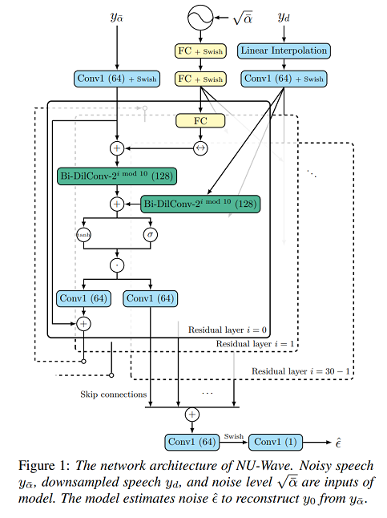

# NU-Wave: A Diffusion Probabilistic Model for Neural Audio Upsampling
For Official repo of NU-Wave: A Diffusion Probabilistic Model for Neural Audio Upsampling visit [here](https://github.com/mindslab-ai/nuwave).
<br />


## Training :
```
python3 train.py  chkpt_dir --max_steps 1000000
```

## Inference :
```
python3 inference.py weights-chkpt.pt low_resolution_22k.wav -o "output.wav"
```

## Citation :
```
@misc{lee2021nuwave,
      title={NU-Wave: A Diffusion Probabilistic Model for Neural Audio Upsampling}, 
      author={Junhyeok Lee and Seungu Han},
      year={2021},
      eprint={2104.02321},
      archivePrefix={arXiv},
      primaryClass={eess.AS}
}
```

## References :
- [Official NU-Wave implementation.](https://github.com/mindslab-ai/nuwave)
- [J.Ho's official DDPM implementation.](https://github.com/hojonathanho/diffusion)
- [ivanvok's WaveGrad pytorch implementation.](https://github.com/ivanvovk/WaveGrad)
- [lmnt-com's DiffWave pytorch implementation.](https://github.com/lmnt-com/diffwave)
- [lmnt-com's WaveGrad pytorch implementation.](https://github.com/lmnt-com/wavegrad)

